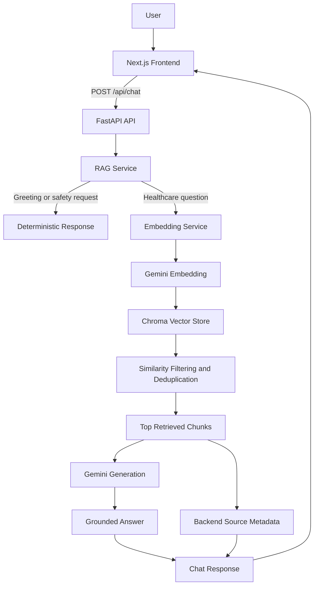
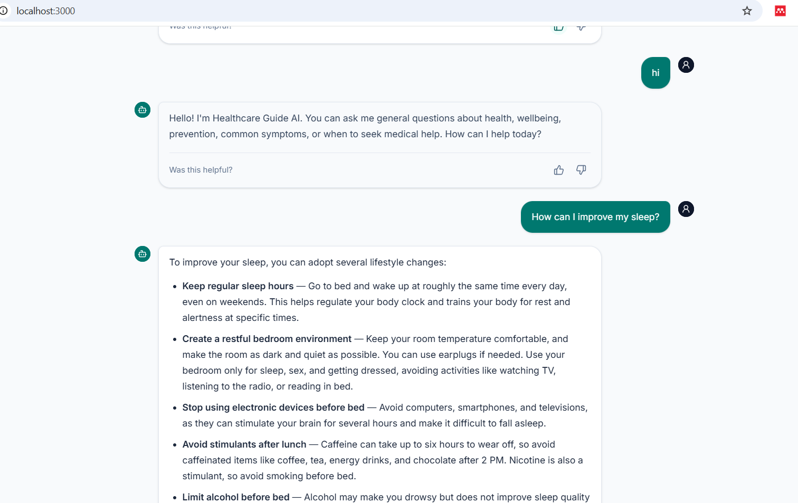
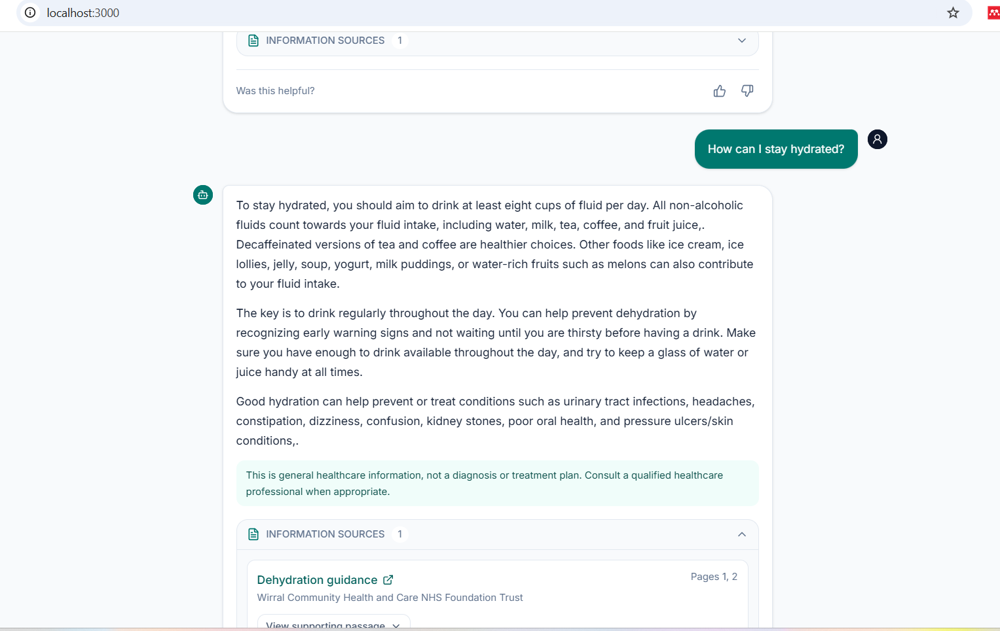
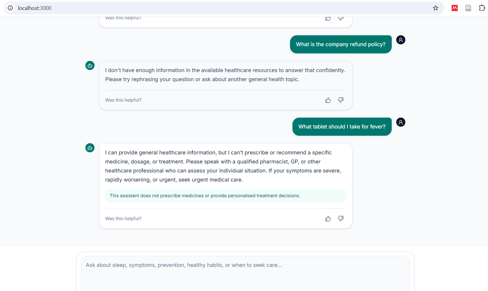

# Healthcare Guide AI

A full-stack Retrieval-Augmented Generation (RAG) application that answers general healthcare questions using a curated collection of public healthcare documents.

The system is designed to provide grounded, source-backed information while avoiding diagnosis, prescriptions, medication recommendations, and personalised treatment advice.

> **Important:** This project is an informational prototype. It is not a medical device and does not replace advice from a qualified healthcare professional.

---

## Features

- Conversational healthcare assistant
- Grounded answers from curated PDF documents
- Gemini embeddings and Gemini answer generation
- Chroma vector search
- Source references with page numbers
- Deterministic greeting handling
- Medication and treatment safety guardrails
- Unsupported-question fallback
- Conversation history support
- Responsive Next.js interface
- FastAPI backend
- 109 passing backend tests
- Provider-neutral error handling
- Production-minded architecture and documentation

---

## Architecture



A more detailed architecture description is available in:

- [`docs/architecture.md`](docs/architecture.md)

---

## Design Decisions and Reasoning

I deliberately chose a simple, classic RAG pipeline rather than using an agent framework such as LangGraph.

The main requirement was to answer questions from a fixed document collection. The workflow only needs:

1. embed the user question.
2. retrieve relevant document chunks.
3. filter weak evidence.
4. generate a grounded answer.
5. return trusted source metadata.

Adding an agent framework would have increased complexity without providing a clear benefit for this use case.

### Why FastAPI and Next.js?

I used FastAPI because it provides typed request validation, dependency injection, clear error handling, and a lightweight API layer for Python-based AI services.
I used Next.js and TypeScript for the frontend because they provide a structured React application, reusable components, and type-safe API integration.

### Why ChromaDB?

I chosed ChromaDB because it is simple to run locally, supports persistent vector storage, and was sufficient for the small curated corpus used in this assignment.
For a production system with multiple backend instances, I would replace local Chroma storage with a managed vector database or PostgreSQL with pgvector.

### Why Gemini?

I used Gemini for both embeddings and grounded answer generation to keep the provider integration focused and reduce unnecessary dependencies.
The embedding model produces 768-dimensional vectors, while 'gemini-2.5-flash' provides an appropriate balance between response quality, latency, and cost for this prototype.

### Why page-local chunks?

Chunks are kept within individual PDF pages so that every result can be associated with an accurate page number.
This is more important for this application than maximising chunk size because users need to understand where healthcare information came from.

### Why deterministic chunk IDs?

Each chunk receives a deterministic hash-based ID. This allows ingestion to be resumed safely and prevents duplicate records when the ingestion command is run multiple times.
This became particularly useful when the embedding provider quota interrupted ingestion.

### Why backend-controlled citations?

The language model may produce numeric citation markers, but source filenames, page numbers, and excerpts are always created from retrieved backend data.
I did not allow the model to generate source metadata because it could invent or misattribute documents.

### Why deterministic safety responses?

Personalised medication and treatment requests are handled before retrieval and generation.
This makes the most important healthcare safety behaviour predictable, testable, and independent of model output.

## Technology Stack

### Frontend

- Next.js
- React
- TypeScript
- Tailwind CSS
- shadcn/ui

### Backend

- Python 3.13
- FastAPI
- Pydantic Settings
- PyMuPDF
- ChromaDB
- Google GenAI SDK
- Pytest

### AI and Retrieval

- Embedding model: `gemini-embedding-2`
- Generation model: `gemini-2.5-flash`
- Embedding dimension: `768`
- Vector database: Chroma
- Indexed chunks: `489`
- Source PDFs: `6`

---

## Project Structure

```text
healthcare-guide-ai/
├── backend/
│   ├── app/
│   │   ├── api/
│   │   ├── core/
│   │   ├── models/
│   │   ├── scripts/
│   │   └── services/
│   ├── data/
│   │   ├── chroma/
│   │   └── documents/
│   ├── tests/
│   ├── .env.example
│   ├── pytest.ini
│   └── requirements.txt
├── frontend/
│   ├── app/
│   ├── components/
│   ├── lib/
│   └── .env.local.example
├── docs/
│   └── architecture.md
├── evaluation/
│   └── evaluation-results.md
├── screenshots/
└── README.md
```

---

## How the RAG Pipeline Works

1. Healthcare PDFs are parsed using PyMuPDF.
2. Repeated headers, footers, page numbers, and bare URLs are removed.
3. Tables are detected and converted to Markdown where appropriate.
4. Text is split into page-local overlapping chunks.
5. Chunks are embedded using `gemini-embedding-2`.
6. Embeddings and metadata are stored in Chroma.
7. A user question is embedded and matched against the vector store.
8. Weak, duplicate, near-duplicate, and low-value results are removed.
9. The top retrieved chunks are passed to Gemini.
10. Gemini generates an answer using only the supplied context.
11. The backend validates citations and attaches trusted source metadata.

---

## Safety Guardrails

The application does not:

- diagnose medical conditions;
- prescribe medicines;
- recommend medication dosages;
- advise users to start, stop, or change treatment;
- answer unsupported questions using general model knowledge.

The application does:

- provide general healthcare information;
- return a deterministic safety response for personalised medication requests;
- return an insufficient-context response when relevant evidence is not found;
- include source filenames and page numbers from backend-controlled metadata;
- encourage users to consult qualified healthcare professionals when appropriate.

---

## Local Setup

## Prerequisites

Install:

- Python 3.13
- Node.js 20 or later
- npm
- Git

You also need a Google Gemini API key.

---

## Backend Setup

From the project root:

```powershell
cd backend
python -m venv .venv
.\.venv\Scripts\Activate.ps1
pip install -r requirements.txt
```

Create the backend environment file:

```powershell
Copy-Item .env.example .env
```

Update `backend/.env`:

```env
GOOGLE_API_KEY=your_google_api_key
GEMINI_EMBEDDING_MODEL=gemini-embedding-2
GEMINI_GENERATION_MODEL=gemini-2.5-flash
EMBEDDING_DIMENSION=768
CHROMA_PATH=./data/chroma
```

Do not commit the real `.env` file.

---

## Document Ingestion

Place the source PDFs in the configured backend documents directory.

Run the ingestion command from `backend`:

```powershell
python -m app.scripts.ingest_corpus
```

The local Chroma database is stored at:

```text
backend/data/chroma
```

The ingestion process uses deterministic chunk IDs, so repeated runs do not create duplicate vectors.

---

## Run the Backend

From `backend`:

```powershell
.\.venv\Scripts\Activate.ps1
python -m uvicorn app.main:app --reload --port 8000
```

Backend URLs:

```text
Health check: http://127.0.0.1:8000/api/health
Chat API:    http://127.0.0.1:8000/api/chat
```

---

## Frontend Setup

Open a second terminal:

```powershell
cd frontend
npm install
```

Create the frontend environment file:

```powershell
Copy-Item .env.local.example .env.local
```

Update `frontend/.env.local`:

```env
NEXT_PUBLIC_API_BASE_URL=http://127.0.0.1:8000
```

Run the frontend:

```powershell
npm run dev
```

Open:

```text
http://localhost:3000
```

---

## API Contract

### Request

```http
POST /api/chat
Content-Type: application/json
```

```json
{
  "question": "How can I improve my sleep?",
  "history": []
}
```

### Response

The response includes:

- the generated answer;
- source metadata;
- safety information;
- insufficient-context status where applicable.

The API contract remained unchanged during production-hardening work.

---

## Testing

From `backend`:

```powershell
$testTemp = Join-Path $env:USERPROFILE ("healthcare-pytest-" + [guid]::NewGuid().ToString())
python -m pytest --basetemp="$testTemp" -p no:cacheprovider
```

Latest result:

```text
109 passed
1 non-blocking Starlette deprecation warning
```

The deprecation warning comes from the current Starlette TestClient dependency and does not affect application behaviour.

Detailed evaluation notes are available in:

- [`evaluation/evaluation-results.md`](evaluation/evaluation-results.md)

---

## Manual Test Cases

Representative questions used during testing:

```text
Hi
How can I improve my sleep?
What are the signs of dehydration?
How can I lower high blood pressure?
How much physical activity should adults do?
What foods support a healthy heart?
What tablet should I take for fever?
Can I take a walk after dinner?
What is the company refund policy?
```

Expected outcomes:

- greetings return immediately;
- supported healthcare questions return grounded answers and sources;
- medication requests return a deterministic safety response;
- unsupported questions return an insufficient-context fallback;
- ordinary wording such as “Can I take a walk?” does not trigger a medication false positive.

---

## Screenshots

Screenshots are stored in the [`screenshots`](screenshots/) directory.

Add the screenshots you captured to this section using their exact filenames, for example:

```markdown





```

---

## Error Handling

The backend returns safe provider-neutral responses for:

- temporary embedding failures;
- temporary generation failures;
- invalid request bodies;
- unexpected server errors.

The application does not expose:

- API keys;
- stack traces;
- model prompts;
- retrieved document content in logs;
- provider-specific internal errors to end users.

---

## Observability

Operational logs include:

- request ID;
- model name;
- query length;
- retrieved candidate count;
- result count;
- context size;
- retrieval duration;
- generation duration;
- success or failure state.

Sensitive user content and secrets are intentionally excluded from logs.

---

## Trade-offs

The implementation focuses on a clean, testable core rather than covering every possible production feature.

### Local Chroma storage

Local persistent Chroma was the most pragmatic choice for the assignment. It keeps development and demonstration simple, but it is not suitable for multiple horizontally scaled backend instances.

### Startup ingestion

The Docker container creates the vector database when it does not already exist.
This makes deployment reproducible, but initial startup can take several minutes and depends on embedding-provider quota. In production, I would run ingestion as a separate background job or deployment step.

### Static curated corpus

The application uses six curated healthcare documents rather than supporting arbitrary uploads.
This kept the scope focused on retrieval quality, safety, citations, and application design.

### Rule-based medication detection

The medication guardrail uses conservative pattern matching to identify personalised medicine requests.
This provides predictable behaviour, but a production version should combine deterministic rules with a separately evaluated safety classifier.

### No authentication or rate limiting

Authentication, user accounts, and rate limiting were intentionally left out because they were not central to demonstrating the RAG workflow.
These would be required before exposing the system as a public production service.

### No OCR

The parser supports text-based PDFs using PyMuPDF. Scanned PDFs would require OCR and additional layout evaluation.

### Provider quotas

The free Gemini tier can return `429` responses when daily embedding limits are reached. The application retries transient failures and returns a safe service-unavailable response, but a production deployment should use a paid quota, monitoring, and provider fallback.

## Known Limitations

- no OCR for scanned PDFs;
- no authentication or multi-user isolation;
- no rate limiting;
- no streaming responses;
- no managed vector database;
- no formal clinical review;
- no regulatory approval;
- no automatic source-expiry workflow;
- no production monitoring platform;
- static curated document corpus;
- local Chroma storage is not suitable for multi-instance horizontal scaling.

---

## What I Would Improve Next

Given more time, I would prioritise the following improvements:

1. Move the vector database to pgvector or a managed vector service.
2. Run ingestion as a separate background job instead of during application startup.
3. Add a labelled retrieval evaluation dataset and measure precision@k and recall@k.
4. Add hybrid keyword and semantic search.
5. Add a reranking step for retrieved chunks.
6. Add token streaming to improve perceived response time.
7. Add authentication, rate limiting, and request quotas.
8. Add structured monitoring, traces, latency metrics, and provider-usage alerts.
9. Add automated source versioning and expiry checks.
10. Perform formal healthcare safety review and adversarial testing.
11. Add OCR support for scanned documents.
12. Add CI/CD checks for tests, linting, frontend builds, and Docker builds.

The first production priority would be separating ingestion from the API runtime and replacing local Chroma storage with managed persistent infrastructure.

## Productionisation Approach

For a production deployment, the following improvements are recommended:

- move documents to managed object storage;
- move vectors to pgvector, Chroma Cloud, or another managed vector database;
- add authentication and authorisation;
- add rate limiting and request quotas;
- add OpenTelemetry traces and structured logs;
- add fallback models and circuit breakers;
- add source versioning and expiry tracking;
- add hybrid retrieval and reranking;
- add automated retrieval evaluation;
- add clinical safety review;
- add GDPR retention and deletion policies;
- add CI/CD and security scanning;
- separate development, staging, and production environments.

---

## Deployment

Deployment URLs will be added after the backend and frontend are deployed.

```text
Frontend: To be added
Backend:  To be added
GitHub:   To be added
```

The planned deployment flow is:

1. create and test the backend Docker image;
2. deploy the backend;
3. deploy the Next.js frontend;
4. update environment variables;
5. update this README with live URLs;
6. run final smoke tests.

---

## Use of AI Coding Tools

I used AI coding tools to accelerate scaffolding, repetitive implementation work, test generation, and code-review suggestions.

I did not treat generated code as automatically correct. I made the architectural decisions, selected the RAG workflow, defined the healthcare safety boundaries, reviewed the generated changes, ran the tests, inspected failures, and changed the implementation based on observed behaviour.

Examples of issues I identified and addressed during development include:

- PDF table false positives;
- weak retrieval for unsupported questions;
- incomplete model responses;
- invalid and grouped citation handling;
- medication-detector false positives;
- blocking synchronous work inside an async route;
- repeated service construction per request;
- embedding-provider quota failures;
- Docker filesystem permissions;
- persistent Chroma storage;
- Docker environment-value quoting;
- CORS configuration.

The final system was validated through 109 automated tests, retrieval inspection, live Gemini calls, Docker testing, and browser-based end-to-end testing.

---

## License

This repository is intended for technical evaluation and demonstration purposes.

The healthcare source documents remain the property of their original publishers and are used for informational demonstration only.
