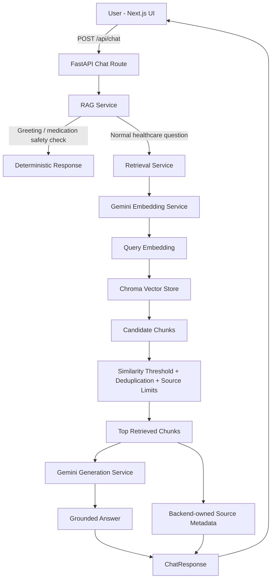

# Healthcare Guide AI — Architecture

## 1. Overview

Healthcare Guide AI is a full-stack Retrieval-Augmented Generation (RAG) application that answers general healthcare questions using a curated collection of public healthcare documents.

The application is designed to:

- answer only from retrieved healthcare sources;
- avoid diagnosis, prescribing, and personalised treatment decisions;
- return source information for traceability;
- provide deterministic responses for greetings, unsupported questions, and medication requests;
- keep retrieval, generation, API, and UI concerns separated.

This repository is a take-home implementation and a production-minded prototype. It is not a medical device and does not replace professional medical advice.

---

## 2. High-level architecture



---

## 3. Runtime request flow

1. The user enters a healthcare question in the Next.js frontend.
2. The frontend sends the question and recent conversation history to `POST /api/chat`.
3. The FastAPI route resolves a cached `RAGService` dependency.
4. `RAGService` validates the question, handles greetings, blocks personalised medication requests, and calls retrieval for normal healthcare questions.
5. `SemanticRetrievalService` creates one query embedding, queries Chroma, applies similarity filtering, removes duplicates and low-value content, and limits results per source.
6. The top three retrieved chunks are passed to the generation layer.
7. `GeminiGenerationService` generates a grounded answer using only supplied context.
8. Citation markers are validated against sources actually supplied.
9. Trusted source metadata is built by backend code from retrieved chunks.
10. The frontend renders the answer, safety notice, and a collapsed “Information sources” section.

---

## 4. Main components

### Frontend

**Technology**

- Next.js App Router
- React
- TypeScript
- Tailwind CSS
- shadcn/ui

**Responsibilities**

- chat interface;
- suggested questions;
- conversation history;
- loading and error states;
- safe answer formatting;
- grouped, friendly source titles;
- expandable supporting passages;
- helpful / not-helpful feedback controls.

The frontend never receives or stores the Gemini API key.

### FastAPI API layer

Key files:

```text
backend/app/main.py
backend/app/api/routes/chat.py
backend/app/api/routes/health.py
```

Responsibilities:

- expose `/api/health`;
- expose `POST /api/chat`;
- validate request and response models;
- configure CORS;
- map transient embedding or generation failures to a provider-neutral `503`;
- return a safe generic `500` response for unexpected failures;
- avoid exposing stack traces, prompts, provider details, or secrets.

The chat route is synchronous because the underlying Gemini SDK and Chroma calls are synchronous. FastAPI executes the route in a worker thread rather than blocking the async event loop.

The RAG dependency is lazily created and cached once per process.

### PDF parsing

Key file:

```text
backend/app/services/pdf_parser.py
```

Responsibilities:

- open and validate PDF files;
- detect encrypted, unsupported, corrupt, or missing files;
- extract page-local text blocks using PyMuPDF;
- detect tables;
- reject common false-positive table candidates;
- convert accepted tables to Markdown;
- preserve page numbers for citations;
- remove repeated headers, footers, page numbers, and bare URLs;
- repair line-break hyphenation and common visual wrapping.

The parser is intentionally conservative. Rejected table regions remain available as prose rather than being silently lost.

### Text chunking

Key file:

```text
backend/app/services/text_chunker.py
```

Current defaults:

```text
Chunk size: 1200 characters
Chunk overlap: 200 characters
```

Responsibilities:

- keep chunks page-local for accurate citations;
- split prose at paragraph and sentence boundaries where possible;
- split oversized passages by words when necessary;
- split large Markdown tables by rows while repeating headers;
- merge useful short passages;
- filter low-information chunks;
- create deterministic SHA-256 chunk IDs.

Deterministic IDs make ingestion resumable and prevent duplicates across repeated runs.

### Embedding service

Key file:

```text
backend/app/services/embedding_service.py
```

Current model:

```text
gemini-embedding-2
```

Current embedding dimension:

```text
768
```

Responsibilities:

- create document and query embeddings;
- keep document and query formatting separate;
- validate response count and vector dimensions;
- retry transient provider errors and rate limits;
- respect provider retry delays where available;
- map provider errors to domain-specific exceptions.

### Vector store

Key file:

```text
backend/app/services/vector_store.py
```

Technology:

```text
Chroma PersistentClient
Cosine distance
```

Responsibilities:

- persist document chunks and metadata;
- upsert vectors using deterministic IDs;
- query by embedding;
- return typed query results;
- preserve source filename, page number, chunk index, content type, table index, and character count.

The current local collection contains 489 indexed chunks from six healthcare PDFs.

### Retrieval service

Key file:

```text
backend/app/services/retrieval_service.py
```

Current configuration:

```text
Top K results: 5
Candidate count: 12
Minimum similarity: 0.62
Maximum chunks per source: 3
```

Responsibilities:

- embed the user question once;
- retrieve semantic candidates from Chroma;
- convert cosine distance to similarity using `1 - distance`;
- reject weak evidence;
- remove duplicate IDs and near-duplicate text;
- filter publication, licensing, contact, and other low-value boilerplate;
- preserve semantic ranking;
- enforce per-source limits.

Retrieval can return up to five chunks for flexibility, while generation receives only the top three.

### Generation service

Key file:

```text
backend/app/services/generation_service.py
```

Current model:

```text
gemini-2.5-flash
```

Responsibilities:

- generate answers from retrieved context only;
- enforce a healthcare safety system instruction;
- disable Gemini 2.5 thinking for predictable grounded answers;
- retry transient provider errors;
- detect empty, missing, or token-limited responses;
- retry once with a larger token allowance if the response is truncated;
- avoid logging the full question, history, prompt, or document text.

### RAG orchestration

Key file:

```text
backend/app/services/rag_service.py
```

Responsibilities:

- validate the question;
- trim conversation history;
- return deterministic greetings;
- return deterministic medication safety responses;
- call retrieval once;
- return an insufficient-context fallback when retrieval has no suitable evidence;
- select the top three context chunks;
- build the generation prompt;
- validate citations;
- build backend-controlled source metadata;
- return a typed `ChatResponse`.

---

## 5. Safety and guardrails

Implemented safeguards include:

- no diagnosis;
- no prescriptions;
- no medication, dosage, or treatment-change recommendations;
- deterministic blocking of personalised medication requests;
- insufficient-context fallback;
- source-grounded generation;
- prompt instruction to treat retrieved documents as untrusted reference material;
- instruction to ignore commands found inside retrieved documents;
- citation validation;
- backend-owned filenames and page numbers;
- provider-neutral error responses;
- no API key exposure to the frontend;
- no raw HTML rendering in the frontend.

---

## 6. Observability

The backend logs operational metadata such as:

- request ID;
- model name;
- query length;
- number of candidates retrieved;
- number of results returned;
- number of context sources;
- context character count;
- retrieval and generation duration;
- success or failure status.

It deliberately does not log API keys, full user questions, conversation history, prompts, or retrieved healthcare passages.

---

## 7. Testing

The backend currently has 109 passing tests.

Coverage includes:

- PDF parsing;
- table detection and rejection;
- chunking;
- embeddings;
- ingestion;
- vector-store behaviour;
- retrieval ranking and filtering;
- grouped citation validation;
- medication-safety detection;
- generation retries and validation;
- API validation;
- transient provider failures;
- production-readiness behaviours.

External Gemini calls are mocked during automated tests.

---

## 8. Current limitations

- no OCR for scanned PDFs;
- complex multi-column layouts may not always preserve perfect reading order;
- local Chroma storage is not suitable for horizontally scaled multi-instance deployment;
- no user authentication or tenant isolation;
- no rate limiting;
- no streaming response;
- no response cache;
- no formal clinical review;
- no healthcare regulatory approval;
- no automated source-expiry workflow;
- no managed tracing or metrics platform;
- no document upload interface;
- the corpus is curated and static.

---

## 9. Productionisation approach

### Data and retrieval

- move documents to managed object storage;
- use pgvector, Chroma Cloud, or another managed vector database;
- version collections and embeddings;
- add background ingestion workers;
- add source review and expiry metadata;
- add hybrid retrieval and reranking.

### API and reliability

- add authentication and authorisation;
- add rate limiting;
- add request and provider timeouts;
- add circuit breakers and fallback models;
- use structured JSON logs and OpenTelemetry;
- add latency, error-rate, and token-usage metrics;
- deploy multiple stateless API instances.

### Healthcare safety

- complete a clinical safety review;
- define approved emergency escalation wording;
- add urgent-symptom classification;
- complete a UK GDPR and data-processing assessment;
- define retention and deletion policies;
- add audit trails and red-team testing.

### Delivery

- add CI/CD;
- run lint, tests, and builds on pull requests;
- use managed secret storage;
- add image scanning;
- separate development, staging, and production environments.

---

## 10. Design choices

### Why classic RAG instead of an agent framework?

The use case is document-grounded question answering. A classic RAG pipeline is simpler, easier to test, easier to observe, and avoids unnecessary autonomy.

### Why page-local chunks?

Page-local chunks preserve accurate page citations and avoid mixing content from separate pages.

### Why deterministic chunk IDs?

They support resumable ingestion and prevent duplicate vectors during repeated runs.

### Why retrieve five but generate from three?

Retrieving five improves inspection and flexibility. Sending only the strongest three chunks reduces prompt noise.

### Why backend-controlled sources?

The model may generate citation markers, but filenames and page numbers come only from retrieved backend data. This prevents fabricated source metadata.

---

## 11. AI-assisted development

AI-assisted coding tools were used as implementation accelerators for scaffolding, focused code generation, tests, and repetitive changes.

The architecture, constraints, healthcare scope, retrieval decisions, safety rules, validation steps, and production trade-offs were defined and reviewed by the developer.

Generated changes were validated using code review, automated tests, real PDF parsing, live embedding ingestion, retrieval inspection, real Gemini API calls, and end-to-end browser testing.
